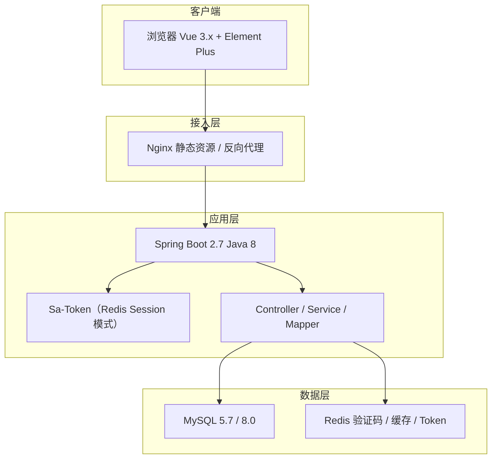
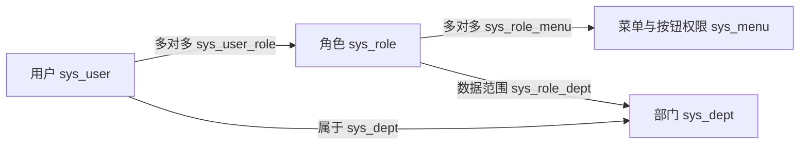
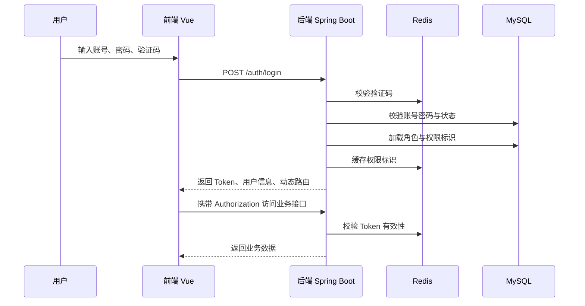
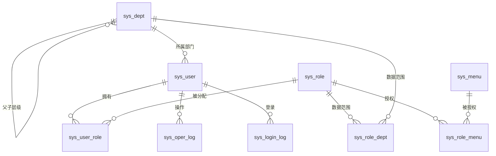

# 权限管理系统需求文档

# 版本记录

| 版本 | 日期 | 作者 | 变更说明 |
| --- | --- | --- | --- |
| V1.0 | 2026-09-12 | 产品（部分内容由豆包生成） | 初版：Java 8 + Vue 2 + MySQL 权限管理系统需求文档。 |
| V1.1 | 2026-09-12 | 产品（部分内容由豆包生成） | 按评审意见修订：统一 Sa-Token 认证表述、补齐业务系统接入章节、部门管理员与自定义数据范围需求、系统参数配置模块、用户表字段与索引、接口清单、错误码与 traceId、安全补强、非功能缺口、技术栈生命周期风险说明。 |
| V1.2 | 2026-09-14 | 产品（部分内容由豆包生成） | 按第二轮评审修订：修正 Sa-Token timeout / activity-timeout 语义、权限与数据范围缓存策略、多角色数据范围并集算法、Token 存放方案统一；补回范围与非目标二级标题、初始化数据小节、接口清单补全（auth/check、批量启停/分配角色、导入模板）、接入指南性能与链路设计、密码复杂度参数、批量删除需求、术语表验证码等。 |
| V1.3 | 2026-09-14 | 产品 | 按第三轮评审修订：①修复格式回归——补回文档标题、前后端交互约定（业务码 / 401 / 403 / 分页语义 / 时区）、权限校验流程被截断的说明、FR-MENU-02 括号、接口设计规范；②修正实现硬伤——权限缓存 key 改为用户维度、在线用户列表禁止全库扫描改为自建 ZSET、新增参数合法性校验 FR-CONFIG-04；③补齐逻辑缝隙——超级管理员通配权限实现、内置角色不可删除与部门管理员标记权限、写操作数据权限约束与 OR 拼接索引风险、越权防护全局表述、日志接口方法拆分、批量删除改 POST、接入方 appId 限流、降级放行风险登记、sys_login_log 字段与索引、登录日志改按月分表。 |
| V1.4 | 2026-09-14 | 产品 | 前端技术栈由 Vue 2 生态升级为 Vue 3 生态（Vue 3 + Vue Router 4 + Pinia + Element Plus + Vite 5），消除 Vue 2 / Element UI 已停止维护的风险；同步更新技术栈表、架构图、Token 存放说明、浏览器兼容性与 Node 版本要求，并新增「前端技术栈变更说明」小节。后端技术栈不变。 |

# 项目概述

## 背景与问题

随着企业信息化推进，多个业务系统（如 OA、CRM、数据后台）各自独立维护账号与权限，产生以下问题：

- 账号分散管理，员工入职开通、离职回收依赖人工逐系统操作，存在越权与回收滞后风险；
- 菜单与按钮权限多在前端写死，权限调整需要改代码、重新发布，交付周期长；
- 缺少统一的操作留痕与审计能力，数据异常时难以追溯责任人与操作时间；
- 部门调整、岗位变动时，权限无法随组织架构自动联动，管理员维护成本高。

## 项目目标

建设一套基于 RBAC 的统一权限管理基础平台，作为后续业务系统的公共底座，达成以下可观测结果：

- 管理员在管理端自助完成用户、角色、菜单、部门与数据权限的配置，全程无需改动代码；
- 权限变更保存后，对用户下一次登录或页面刷新即时生效；
- 新用户从开通账号到获得可用权限不超过 30 分钟（管理端自助完成）；
- 所有登录与关键写操作可追溯，支持按用户、时间、模块检索。

## 术语定义

| 术语 | 说明 |
| --- | --- |
| RBAC | 基于角色的访问控制（Role-Based Access Control），通过“用户—角色—权限”的关联完成授权。 |
| Sa-Token | 轻量级 Java 权限认证框架，本系统采用其 Redis Session 模式：Token 存 Redis，支持即时失效、自动续签与踢人下线。 |
| 菜单权限 | 控制用户可见的目录、菜单页面与按钮（如新增、删除、导出）。 |
| 权限标识 | 后端接口声明的最小权限单元字符串，遵循“模块:功能:动作”规范（如 system:user:add），由 @SaCheckPermission 校验。 |
| 数据范围 | 控制用户对业务数据的可见范围（全部、本部门及以下、本部门、仅本人、自定义），由角色 data_scope 配置。 |
| 在线用户 | 当前持有有效会话（Redis 中 Token 未过期）的用户，可在系统监控中查看并强制下线。 |
| 动态路由 | 前端根据用户权限动态生成的页面路由与菜单。 |
| 超级管理员 | 系统内置最高权限账号，拥有全部权限且不可删除、不可停用。实现上由 `StpInterface` 对 admin 账号直接返回通配权限 `*:*:*`，不依赖角色表；其角色关联不可被移除（对应“不可被降权”）。 |
| 验证码 | 登录页图形验证码：服务端生成并以 captchaKey 关联存储，有效期 2 分钟、一次有效；前端登录时回传 captchaKey 与用户输入。 |

# 范围与非目标

## 本期范围

- 认证与登录：账号密码登录、图形验证码、Sa-Token 会话签发、自动续签与退出登录；
- 用户管理：用户增删改查、启停用、重置密码、分配角色与部门、批量导入与批量停用；
- 角色管理：角色增删改查、菜单权限分配、数据权限范围配置（含自定义部门范围）；
- 菜单管理：目录、菜单、按钮三级权限配置与排序；
- 部门管理：部门树维护，支持多级组织架构；
- 数据权限：按角色配置数据可见范围，并在查询接口统一生效；
- 审计日志：登录日志与操作日志的记录、查询与导出；
- 系统参数配置：默认密码、密码强度、日志保留策略等运行参数可配置；
- 个人中心：个人信息维护、密码修改、查看本人权限。

## 非目标（本期不做）

> 以下能力本期明确不做，避免范围蔓延；如后续业务需要，作为独立迭代纳入排期。

- 单点登录（SSO / CAS / OAuth2 外部登录）对接，本期仅预留扩展点；
- 多租户隔离，本期按单租户实现；
- 工作流审批、消息通知、公告管理；
- 文件管理与对象存储；
- 微服务化拆分，本期以单体应用交付，模块按可拆分边界设计。
- 自助找回密码：本期不提供“忘记密码”自助找回，用户忘记密码由管理员重置，避免验收争议。
- 字典管理：本期不提供独立字典模块，选项值采用硬编码 + sys_config 参数兜底。

# 用户角色与核心场景

## 用户角色定义

| 角色 | 权限说明 | 典型使用者 |
| --- | --- | --- |
| 超级管理员 | 内置账号，拥有全部菜单与数据权限，不可删除、不可停用、不可被降权。 | 平台负责人 |
| 系统管理员 | 管理用户、角色、菜单、部门与日志，可配置数据权限范围。 | IT 管理员 |
| 部门管理员 | 仅能管理本部门及下级部门的用户与角色分配，数据范围受限。 | 部门负责人 |
| 普通用户 | 使用被授权的业务菜单，维护个人中心信息。 | 业务人员 |

## 核心使用场景

1. 初始化配置：超级管理员登录后建立部门树、创建角色、配置菜单权限与数据范围；
2. 权限开通：管理员新增用户并分配部门与角色，用户即可登录并看到对应菜单；
3. 日常使用：用户登录后按动态路由进入授权页面，按钮级权限随接口校验生效；
4. 组织与权限变更：部门调整、角色权限变更保存后，对用户下一次登录或刷新即时生效；
5. 审计排查：安全人员按条件检索登录与操作日志，定位异常行为。

# 技术架构

## 技术栈

| 层 | 技术选型 | 说明 |
| --- | --- | --- |
| 后端 | Java 8、Spring Boot 2.7.x、Sa-Token（Redis Session 模式） | 认证授权基于 Sa-Token，会话存 Redis（Session 模式），支持即时失效与自动续签。 |
| 持久层 | MyBatis-Plus、MySQL 5.7 / 8.0 | 通用 CRUD 与分页能力；SQL 全部预编译防注入。 |
| 缓存 | Redis | 验证码、权限标识缓存、Token 黑名单、在线用户。 |
| 前端 | Vue 3.x、Vue Router 4、Pinia、Element Plus、Axios、Vite 5 | 动态路由 + 按钮指令控制；统一请求封装。前端已由 Vue 2 生态调整为 Vue 3 生态（变更原因与对照表见版本记录 V1.4）。 |
| 部署 | Nginx、Maven、JDK 8 | Nginx 托管前端静态资源并反向代理后端接口。 |

## 前端技术栈变更说明（Vue 2 → Vue 3）

本项目前端尚未启动开发，**本次为技术选型调整，不涉及存量代码迁移**。选型切换原因：Vue 2 与 Element UI 已于 2023 年底停止维护，Vue 3 生态处于活跃维护期，可在项目起步阶段以零成本规避该风险。

| 能力 | 原选型（Vue 2 生态） | 现选型（Vue 3 生态） | 说明 |
| --- | --- | --- | --- |
| 框架 | Vue 2.7 | Vue 3.4+ | 支持组合式 API、`<script setup>` |
| 路由 | Vue Router 3 | Vue Router 4 | `new VueRouter` → `createRouter`；`addRoutes` 已移除，改为循环 `addRoute`；`path: '*'` 改为 `path: '/:pathMatch(.*)*'` |
| 状态管理 | Vuex 3 | Pinia 2 | `state` / `getters` / `commit` 模式简化；持久化使用 `pinia-plugin-persistedstate` |
| UI 组件库 | Element UI 2.15 | Element Plus 2.6+ | `visible.sync` → `v-model`；`slot-scope` → `#default`；图标改为组件形式；`ElMessage` 等需显式导入 |
| 构建工具 | Vue CLI 5（webpack） | Vite 5 | 环境变量由 `process.env.VUE_APP_*` 改为 `import.meta.env.VITE_*`；需 Node 18+ |
| 请求库 | Axios | Axios | 无变化 |
| 按钮权限指令 | `Vue.directive` | `app.directive` | 指令钩子更名：`bind`→`beforeMount`、`inserted`→`mounted`、`unbind`→`unmounted` |

**对既有需求的影响**：功能需求（第 6 章）、接口设计（第 8 章）、权限模型（第 5 章）**均不受影响**——后端接口契约与动态路由数据格式保持不变，前端仅更换实现技术栈。仅非功能需求中的浏览器与构建环境要求需同步调整（见「可用性与可维护性」）。

## 系统架构

## 前后端交互约定

- 接口风格：RESTful，统一响应体 `{"code": 200, "msg": "success", "data": ...}`，业务错误返回非 200 的业务码；
- 认证方式：前端将 Token 放入请求头 `Authorization: Bearer <token>`；未认证返回 401，无权限返回 403；
- 分页约定：查询接口统一使用 `pageNum`、`pageSize` 作为入参，返回 `total` 与 `rows`；
- 日期格式：统一为 `yyyy-MM-dd HH:mm:ss`，时区为 Asia/Shanghai。

# 权限模型

## RBAC 模型

系统采用 RBAC 模型：用户通过角色获得权限，角色关联菜单与按钮权限，同时通过部门建立数据权限边界。

## 权限校验流程

1. 前端：登录后获取用户角色与权限标识，动态生成路由与菜单；按钮级权限通过指令 `v-permission` 控制显隐；
2. 后端：接口通过 `@SaCheckPermission` 注解声明所需权限标识（如 `system:user:add`），请求到达时由 Sa-Token 拦截器校验；
3. 双重校验原则：前端控制仅用于交互体验，最终以服务端校验为准，防止绕过前端直接调用接口。

## 数据权限模型

| 数据范围 | 说明 | SQL 落点 |
| --- | --- | --- |
| 全部数据 | 可见全部部门数据，默认超级管理员。 | 不追加过滤条件 |
| 本部门及以下 | 可见本部门及其所有下级部门数据。 | dept_id IN (本部门及子孙部门) |
| 本部门 | 仅可见本部门数据。 | dept_id = 本部门 |
| 仅本人 | 仅可见本人创建/所属数据。 | create_by = 当前用户 |
| 自定义（data_scope=5） | 管理员在部门树中勾选指定部门，仅可见所选部门数据，关联关系存 sys_role_dept。 | dept_id IN (自定义部门集合) |

实现方式：角色表 data_scope 记录数据权限枚举，业务查询通过 MyBatis-Plus 数据权限插件在 SQL 层统一追加过滤条件。详细约定如下：

- 多角色合并算法（防数据丢失）：任一角色为“全部数据”时不过滤；否则取各角色可见范围的并集——本部门及以下/本部门展开为部门 ID 集合、自定义为勾选部门集合、仅本人转为 create_by 条件，多条件之间用 OR 拼接，不再按范围大小取单一优先级。
- 同一角色内 data_scope 唯一（=5 自定义时勾选部门集合存 sys_role_dept），不存在枚举与自定义共存；跨角色合并时直接对各角色可见集合取并集。判定规则：全部数据 → 不过滤；任一角色“仅本人” → 追加 create_by = 当前用户 的 OR 条件；其余范围 → 部门 ID 集合取并集。
- 字段约定：业务表须含 dept_id 与 create_by 字段（命名可配置）；无 dept_id / create_by 字段的表默认按“仅本人”处理或显式标注跳过数据权限，避免静默放行。
- 兼容性要求：插件必须兼容分页查询（count 语句同样追加条件）、导出（全量查询追加条件）、联表与子查询（条件注入到主表或指定表别名）；开发期对每类查询补充数据权限测试用例。
- 白名单：登录、验证码、个人中心、公共配置等查询跳过数据权限拦截，白名单集中配置并随代码评审维护。
- 写操作同样受数据权限约束：新增/编辑用户、分配角色、修改部门等写接口须校验目标用户（及其 dept_id）落在操作者数据范围内，范围外一律拒绝；数据权限不得只作用于查询。
- 性能风险提示：多角色并集会产生 `dept_id IN (...) OR create_by = ?` 形式的条件，10 万级数据下存在索引失效风险。业务表必须为 `dept_id`、`create_by` 建立索引；压测阶段须单独验证该场景，必要时改为拆分查询后取并集。

## 权限生效时机矩阵

不同权限变更的生效时机不同，开发与验收按下表统一口径；权限缓存 key 设计见缓存策略说明。

| 变更类型 | 生效时机 | 说明 |
| --- | --- | --- |
| 角色菜单/按钮权限变更 | 下次登录 / 主动刷新页面 | 权限标识缓存按用户维度，变更时 `DEL sa:permission:<userId>` 精确失效；需立即生效时管理员调用“强制下线”踢人。 |
| 用户停用 / 删除 | 下一次接口调用立即失效 | 停用即删除 Redis 会话，Token 即刻不可用。 |
| 角色数据范围变更 | 下一次查询（等效实时） | 数据权限走 5 分钟短 TTL 缓存，变更时主动失效对应缓存，下一次查询即生效，无需重新登录。 |
| 部门结构（树）调整 | 下一次查询（等效实时） | “本部门及以下”范围依赖最新部门树；部门变更时主动失效相关部门关联的数据范围缓存。 |
| 强制下线 | 立即 | 管理员操作后该用户 Token 立即失效。 |

**权限缓存策略**：权限标识按**用户维度**缓存于 Redis（key 形如 `sa:permission:<userId>`），TTL 30 分钟兜底。

> 设计说明：缓存内容是“该用户拥有的权限标识集合”，与会话无关，因此**不按 Token 分维度**。若 key 中拼接 tokenValue，同一用户多会话会产生多份完全相同的缓存，且变更时若要按 userId 清理，只能用 `KEYS` / `SCAN` 做前缀匹配——`KEYS` 在生产环境禁用，`SCAN` 为 O(N)，均不可接受。

角色菜单/按钮权限变更时直接 `DEL sa:permission:<userId>` 精确失效（不清空全量，不会缓存风暴）；需要立即生效时再调用“强制下线”踢人；前端刷新页面时强制重新调用 `/api/auth/info` 拉取最新权限。

**数据范围缓存策略**：采用短 TTL 缓存（5 分钟），与性能指标（权限校验额外开销 ≤50ms、列表 P95 ≤1s）协调。失效触发点如下：

| 触发事件 | 失效范围 |
| --- | --- |
| 角色数据范围变更（FR-ROLE-03 / FR-ROLE-05） | 拥有该角色的全部用户 |
| 部门树变更（新增、变更父级，FR-DEPT-04） | 该部门及其子孙部门关联的全部用户（部门变更低频，允许适当放大失效范围） |
| 用户角色分配变更（FR-USER-03 / FR-USER-09） | 该用户 |

因此生效时机矩阵中“下一次查询”为等效实时——变更时已主动失效缓存。

# 功能需求

以下需求按模块编号，需求描述采用“行为 + 可观察结果”写法，验收标准可直接转化为测试用例。优先级：P0 必须、P1 重要、P2 可选。

## 登录与认证（P0）

核心流程如下：

| 编号 | 需求描述（行为化） | 验收标准 |
| --- | --- | --- |
| FR-AUTH-01 | 用户在登录页输入账号、密码与图形验证码，点击登录后系统完成校验并签发 Token。 | 正确凭据 2 秒内返回登录成功与 Token；验证码错误提示“验证码错误”且不进行账号校验。 |
| FR-AUTH-02 | 验证码有效期 2 分钟，一次有效；连续输入错误自动刷新。 | 过期验证码提交返回“验证码已过期”；同一验证码第二次提交失败。 |
| FR-AUTH-03 | 登录成功后签发 Token（Sa-Token 会话模式）：默认配置 timeout=7 天（Token 绝对有效期）、activity-timeout=2 小时（连续无操作自动下线），用户 2 小时内有操作则自动续签、最长保持 7 天在线，无需独立 refreshToken 接口；以上为默认值，可通过系统参数覆盖（见 FR-CONFIG-02，须满足 FR-CONFIG-04 的合法性校验）。 | 连续 2 小时内有操作则自动续签、前端无感；2 小时内无操作或超过 7 天绝对有效期后，携带旧 Token 访问返回 401，需重新登录。 |
| FR-AUTH-04 | 登录成功后返回用户基本信息、角色编码、权限标识集合与动态路由，前端据此渲染菜单。 | 普通用户登录后仅看到其角色授权范围内的菜单与按钮；无权限菜单不出现。 |
| FR-AUTH-05 | 同一账号连续密码错误 5 次后锁定 15 分钟（次数与时长为默认值，取系统参数配置，见 FR-CONFIG-02）；锁定期间提示剩余时间。 | 第 5 次错误后登录返回“账号已锁定，请 15 分钟后再试”；锁定到期后自动恢复。 |
| FR-AUTH-06 | 停用账号禁止登录；已登录用户被停用后，下一次接口调用即失效。 | 停用账号登录返回“账号已停用，请联系管理员”；停用即删除 Redis 会话，已签发 Token 在下一次请求即时失效。 |
| FR-AUTH-07 | 用户点击退出后 Token 立即失效，前端跳转登录页。 | 退出后使用原 Token 访问受保护接口返回 401。 |
| FR-AUTH-08 | 首次登录（pwd_reset_flag=1）或密码已过期时，登录成功后强制跳转修改密码页，未完成修改前禁止访问业务页面。 | 强制改密用户登录后仅可访问修改密码接口；完成修改后 pwd_reset_flag 置 0，清除会话并跳转登录页，用新密码重新登录。 |

## 用户管理（P0）

| 编号 | 需求描述（行为化） | 验收标准 |
| --- | --- | --- |
| FR-USER-01 | 用户列表支持按用户名、手机号、状态、所属部门分页查询，列表展示用户名、姓名、部门、手机号、状态、创建时间。 | 任一组合条件查询结果与筛选条件一致；分页数据量与 total 一致。 |
| FR-USER-02 | 管理员新增用户，填写用户名、姓名、手机号、邮箱，选择部门与角色；用户名为唯一标识，初始密码为系统参数配置的默认密码（首次登录强制修改）。 | 用户名重复时提示“用户名已存在”且不创建；创建成功后列表立即可见；新用户可用初始密码登录，且被强制要求修改密码。 |
| FR-USER-03 | 管理员编辑用户基本信息、部门与角色；角色支持多选。 | 保存后用户角色变更对下次登录生效；手机号重复时给出明确提示。 |
| FR-USER-04 | 管理员可停用/启用用户；支持删除用户（逻辑删除）。 | 停用用户无法登录；删除后列表不再展示；超级管理员账号不可删除、不可停用。 |
| FR-USER-05 | 管理员可重置指定用户密码为系统参数配置的默认初始密码。 | 重置后旧密码失效，新密码为默认初始密码并强制首次修改。 |
| FR-USER-06 | 用户列表支持按当前查询条件导出 Excel（用户名、姓名、部门、手机号、状态、创建时间）。 | 导出文件列与筛选结果一致，文件可正常打开且无乱码。 |
| FR-USER-07 | 管理员通过 Excel 模板批量导入用户，模板含用户名、姓名、手机号、邮箱、部门编码、角色编码；导入采用“先全量校验、校验全过后整批提交”策略，失败整批回滚并按行返回错误原因。 | 合法行全部创建成功；含错误行时整批不写入（事务回滚）并逐行返回错误原因（如“第 3 行：用户名已存在”），不产生部分成功数据；修正错误行后重新导入即可。 |
| FR-USER-08 | 用户列表支持勾选多个用户批量停用/批量启用。 | 批量操作后所有目标用户状态一致变更；勾选包含超级管理员或当前登录账号时提示并跳过。 |
| FR-USER-09 | 支持勾选多个用户批量分配角色（追加模式，不清空已有角色）。 | 批量分配后目标用户角色增加指定角色，原有角色保留；结果列表展示成功数量。 |
| FR-USER-10 | 用户列表支持勾选多个用户批量删除（逻辑删除），超级管理员账号不可选。 | 批量删除后目标用户从列表消失且数据可恢复（逻辑删除）；勾选包含超级管理员或当前登录账号时提示并跳过。 |

异常与边界：禁止删除/停用当前登录账号自身；被删除用户的历史操作日志保留不删除。

## 角色管理（P0）

| 编号 | 需求描述（行为化） | 验收标准 |
| --- | --- | --- |
| FR-ROLE-01 | 角色支持增删改查，字段含角色名称、角色编码（唯一）、排序、状态、备注。 | 角色编码重复时提示且不保存；停用角色不在新增用户的可选列表中出现。 |
| FR-ROLE-02 | 为角色分配菜单与按钮权限，以菜单树勾选形式选择；保存后对用户下一次登录生效。 | 勾选目录时默认联动其下菜单；保存后拥有该角色的用户刷新页面可见对应菜单与按钮。 |
| FR-ROLE-03 | 为角色配置数据权限范围：全部数据、本部门及以下、本部门、仅本人、自定义。 | 不同数据范围的角色在业务列表查询中返回不同范围数据；“全部数据”仅超级管理员可配置，系统管理员可配置其余四种范围。 |
| FR-ROLE-04 | 删除角色前校验是否被用户引用；初始化写入的 4 个内置角色（超级管理员、系统管理员、部门管理员、普通用户）禁止删除。 | 角色已被用户引用时提示“该角色已分配用户，请先解除关联”；未被引用时可删除；删除内置角色时提示“内置角色不可删除”并拒绝。 |
| FR-ROLE-05 | 角色数据范围选择“自定义”时，管理员在部门树中勾选可见部门集合，保存至 sys_role_dept。 | 勾选部门后，拥有该角色的用户查询仅返回所选部门数据；未勾选任何部门时保存报错并提示。 |
| FR-ROLE-06 | 角色的“部门管理员”标记（dept_admin_flag）仅超级管理员可设置或取消，系统管理员不可变更。 | 系统管理员在角色编辑界面看到该开关为禁用态；直接调用接口修改返回 403。 |

## 菜单与权限管理（P0）

| 编号 | 需求描述（行为化） | 验收标准 |
| --- | --- | --- |
| FR-MENU-01 | 菜单支持目录、菜单、按钮三种类型，以树形结构维护；字段含名称、路由地址、组件路径、权限标识、排序、显示状态、图标。 | 树形结构正确展示层级；保存后刷新动态菜单可见变更。 |
| FR-MENU-02 | 权限标识全局唯一，作为接口鉴权依据（如 `system:user:add`）。 | 重复权限标识提示且不保存；后端接口按该标识鉴权生效。 |
| FR-MENU-03 | 删除菜单时校验是否存在子菜单。 | 存在子菜单时提示“存在子菜单，请先删除子菜单”；删除按钮类型权限后前端按钮隐藏且接口返回 403。 |
| FR-MENU-04 | 菜单支持显示/隐藏切换；隐藏菜单不渲染到侧边栏但路由仍可访问（用于详情页等场景）。 | 隐藏后侧边栏不展示；有权限用户仍可通过 URL 访问对应页面。 |

## 部门管理（P0）

| 编号 | 需求描述（行为化） | 验收标准 |
| --- | --- | --- |
| FR-DEPT-01 | 部门支持树形结构维护，字段含部门名称、部门编码（唯一）、父级部门、排序、状态。 | 编码重复时提示且不保存；树形层级展示正确。 |
| FR-DEPT-02 | 部门层级深度不超过 5 级。 | 在第 5 级下新增子部门时提示“已达最大层级”。 |
| FR-DEPT-03 | 删除部门时校验：存在子部门或存在归属用户时禁止删除。 | 有子部门或用户时提示原因并拒绝删除。 |
| FR-DEPT-04 | 部门调整（新增、变更父级）后，关联该部门的数据权限按最新树结构生效。 | 变更父部门后，“本部门及以下”范围用户下一次查询按新结构返回数据。 |
| FR-DEPT-ADMIN-01 | 部门管理员（角色 dept_admin_flag=1，创建时锁定 data_scope=2 本部门及以下且不允许修改为其他范围）执行用户新增、编辑、删除、重置密码、分配角色时，仅能操作其数据范围内的用户；可分配的角色为除超级管理员外的全部启用角色，但被分配用户必须在其数据范围内。 | 部门管理员查询用户仅返回范围内数据；直接调用范围外用户的管理接口返回 403；界面不展示范围外用户的操作入口；角色编辑界面锁定其数据范围为“本部门及以下”且不可修改。 |

## 审计日志（P1）

| 编号 | 需求描述（行为化） | 验收标准 |
| --- | --- | --- |
| FR-LOG-01 | 记录登录日志：账号、IP、浏览器、操作系统、登录结果、失败原因、时间。 | 登录成功与失败均产生一条记录；列表支持按账号、时间、结果筛选。 |
| FR-LOG-02 | 记录操作日志：操作人、模块、操作类型（新增/修改/删除/查询/导出）、方法、请求参数、IP、耗时、结果（成功/失败及原因）。 | 对用户、角色、菜单、部门的写操作均产生日志；敏感字段（密码、Token）脱敏后记录。 |
| FR-LOG-03 | 日志列表支持按操作人、模块、时间范围分页查询，并支持导出。 | 查询结果与条件一致；导出文件列完整、无乱码。 |
| FR-LOG-04 | 日志保留策略可配置（默认保留 180 天），到期自动清理。 | 配置 30 天后，超过 30 天的日志被自动清理且不影响新日志写入。 |

## 个人中心（P1）

| 编号 | 需求描述（行为化） | 验收标准 |
| --- | --- | --- |
| FR-PROFILE-01 | 用户可查看并修改本人姓名、手机号、邮箱。 | 保存后个人信息立即更新；手机号重复时提示。 |
| FR-PROFILE-02 | 用户修改密码需输入旧密码、新密码、确认密码；新密码强度要求：至少 8 位且包含字母与数字。 | 旧密码错误时提示且不修改；弱密码拒绝并提示规则；修改成功后清除当前会话并跳转登录页，需用新密码重新登录。 |
| FR-PROFILE-03 | 用户可查看本人所属部门、角色与权限标识列表。 | 展示内容与后台配置一致。 |

## 系统监控（P2 可选）

| 编号 | 需求描述（行为化） | 验收标准 |
| --- | --- | --- |
| FR-MON-01 | 管理员可查看在线用户列表（账号、登录 IP、登录时间），并强制下线指定用户。 | 在线列表实时反映当前有效 Token 用户；强制下线后该用户 Token 立即失效；10 万级用户下在线列表查询 P95 ≤1s。 |
| FR-MON-02 | 展示服务基本信息（版本、运行时长）与 Redis、数据库连接状态。 | 信息展示正确；组件异常时显示异常状态。 |

实现约束（针对 FR-MON-01）：禁止使用 Sa-Token 的 `searchSessionId` 等全库 key 扫描方式获取在线用户（用户量大时会阻塞 Redis）。须自行维护在线用户集合：登录成功 `ZADD online:users <时间戳> <loginId>`，退出 / 强制下线 / 停用时 `ZREM`，并配合 Redis 键空间通知或定时任务清理已过期会话。在线列表接口直接分页读取该集合。

## 系统参数配置（P1）

| 编号 | 需求描述（行为化） | 验收标准 |
| --- | --- | --- |
| FR-CONFIG-01 | 管理员可维护系统参数（参数名、参数键、参数值、备注）；参数键全局唯一。 | 参数键重复时提示且不保存；修改参数值保存后即时生效。 |
| FR-CONFIG-02 | 内置参数：默认初始密码（sys.user.initPassword）、密码最小长度、密码需含字母（sys.pwd.requireLetter）、密码需含数字（sys.pwd.requireDigit）、密码需含特殊字符（sys.pwd.requireSymbol）、登录失败锁定次数、锁定分钟数、日志保留天数、会话超时时间（含 timeout 与 activity-timeout 两项）。 | 修改默认密码后，新用户/重置密码使用新值；修改密码强度参数后，新设密码按新规则校验；修改日志保留天数后，清理策略按新值执行。 |
| FR-CONFIG-03 | 参数修改记录写入操作日志，保留修改前后值（密码类参数值脱敏为“****”）。 | 修改操作在操作日志中可查，包含操作人与修改前后值（脱敏后）。 |
| FR-CONFIG-04 | 参数保存时做合法性校验：会话参数须满足 activity-timeout ≤ timeout；锁定次数、锁定分钟数、密码最小长度须 ≥1 且不超过合理上限（锁定分钟数 ≤1440、密码最小长度 ≤64）；日志保留天数 ≥1。 | 配置 activity-timeout 大于 timeout 时拒绝保存并提示“无操作下线时长不得大于 Token 绝对有效期”（否则参数静默失效）；配置越界数值时提示允许范围且不保存。 |

# 数据库设计

## 核心实体关系

## 核心表清单

| 表名 | 用途 | 关键说明 |
| --- | --- | --- |
| sys_user | 用户表 | 逻辑删除标记 del_flag；密码 BCrypt 加密存储；含强制改密、锁定、登录信息字段。 |
| sys_role | 角色表 | data_scope 记录数据权限枚举；dept_admin_flag 标记部门管理员角色。 |
| sys_menu | 菜单与权限表 | menu_type 区分目录/菜单/按钮。 |
| sys_dept | 部门表 | ancestors 记录祖先链，加速子树查询。 |
| sys_user_role | 用户角色关联表 | 联合唯一索引 (user_id, role_id)。 |
| sys_role_menu | 角色菜单关联表 | 联合唯一索引 (role_id, menu_id)。 |
| sys_role_dept | 角色数据范围部门关联表 | 仅“自定义数据范围”场景使用。 |
| sys_config | 系统参数配置表 | 参数键唯一；初始密码、锁定策略、日志保留天数等。 |
| sys_login_log | 登录日志表 | 按月分表 + 定时归档（MySQL 分区键须包含在所有唯一键内且分区数有限，本期不采用分区方案）。 |
| sys_oper_log | 操作日志表 | 按策略定期清理。 |

## 关键表字段说明

以下为核心表的必备字段清单（公共字段：create_by、create_time、update_by、update_time、del_flag、remark）。

| 表 | 字段 | 类型 | 说明 |
| --- | --- | --- | --- |
| sys_user | user_id / username / password / nickname / phone / email / dept_id / status / pwd_reset_flag / lock_status / lock_time / last_login_ip / last_login_time / pwd_update_time / version | bigint / varchar(50) / varchar(100) / varchar(50) / varchar(20) / varchar(50) / bigint / char(1) / char(1) / char(1) / datetime / varchar(50) / datetime / datetime / int | username 唯一索引；password 为 BCrypt 密文；status 0 正常 1 停用；pwd_reset_flag 1 强制改密；lock_status/lock_time 支撑登录锁定；last_login_* 支撑可观测性；version 乐观锁。 |
| sys_role | role_id / role_name / role_key / data_scope / dept_admin_flag / status / sort | bigint / varchar(50) / varchar(100) / char(1) / char(1) / char(1) / int | role_key 唯一；data_scope 1 全部 2 本部门及以下 3 本部门 4 仅本人 5 自定义；dept_admin_flag 标记部门管理员角色。 |
| sys_menu | menu_id / parent_id / menu_name / menu_type / path / component / perms / order_num / visible | bigint / bigint / varchar(50) / char(1) / varchar(200) / varchar(255) / varchar(100) / int / char(1) | menu_type M 目录 C 菜单 F 按钮；perms 权限标识。 |
| sys_dept | dept_id / parent_id / dept_name / dept_key / ancestors / order_num / status | bigint / bigint / varchar(50) / varchar(50) / varchar(500) / int / char(1) | dept_key 唯一；ancestors 存祖先链如 “0,100,101”。 |
| sys_config | config_id / config_name / config_key / config_value / config_type / remark | bigint / varchar(100) / varchar(100) / varchar(500) / char(1) / varchar(500) | config_key 唯一；config_type 区分系统内置/用户扩展。 |
| sys_oper_log | oper_id / title / oper_type / method / oper_name / oper_param / oper_ip / status / error_msg / cost_time / trace_id | bigint / varchar(50) / char(1) / varchar(200) / varchar(50) / varchar(2000) / varchar(50) / char(1) / varchar(2000) / bigint / varchar(50) | oper_param 记录脱敏后的请求参数；trace_id 关联链路日志。 |
| sys_login_log | login_id / username / login_ip / browser / os / status / msg / login_time | bigint / varchar(50) / varchar(50) / varchar(100) / varchar(50) / char(1) / varchar(255) / datetime | status 0 成功 1 失败；msg 记录失败原因；登录成功与失败均记录。 |

## 索引设计

| 表 | 索引 | 说明 |
| --- | --- | --- |
| sys_user | uk_username (username)；idx_dept_id (dept_id)；idx_status (status) | username 唯一索引支撑登录与唯一性校验；dept_id、status 支撑列表筛选。 |
| sys_user_role | uk_user_role (user_id, role_id) | 联合唯一索引防重复分配。 |
| sys_role_menu | uk_role_menu (role_id, menu_id) | 联合唯一索引防重复授权。 |
| sys_role_dept | idx_role_dept (role_id, dept_id) | 支撑自定义数据范围查询。 |
| sys_dept | idx_parent_id (parent_id) | 支撑部门树构建。 |
| sys_config | uk_config_key (config_key) | 参数键唯一，支撑参数查询与唯一性校验。 |
| sys_oper_log | idx_oper_time (oper_time)；idx_username (username) | 操作日志按时间与用户检索高频，清理策略执行前必须建时间索引。 |
| sys_login_log | idx_login_time (login_time)；idx_username (username) | 登录日志按时间与账号检索高频，按月分表归档前必须建时间索引。 |

## 初始化数据

数据库初始化脚本（建议使用 Flyway / Liquibase 做脚本版本管理，避免多环境脚本漂移）一次性写入以下基础数据：

- 超级管理员账号 admin：初始密码取系统参数 sys.user.initPassword，且 pwd_reset_flag=1 强制首次改密，账号不可删除、不可停用；其权限由 StpInterface 返回通配权限 `*:*:*`，不依赖角色表；
- 内置角色：超级管理员、系统管理员、部门管理员（dept_admin_flag=1、data_scope=2）、普通用户；内置角色不可删除；
- 菜单与权限标识全量数据：系统管理（用户/角色/菜单/部门/系统参数配置）、日志监控（登录日志/操作日志/在线用户）、个人中心等目录、菜单与按钮节点及其权限标识；
- sys_config 内置参数默认值：默认初始密码、密码最小长度、密码强度要求、锁定策略、日志保留天数、会话超时时间。

# 接口设计

- 统一前缀 `/api`；响应体 `{"code": 200, "msg": "success", "data": {}, "traceId": "..."}`，业务错误返回非 200 的业务码；
- 鉴权：除登录、验证码外，全部接口校验 `Authorization: Bearer <token>`；未认证返回 401，无权限返回 403；
- 权限标识：写操作接口通过 `@SaCheckPermission` 注解声明权限标识，如 `system:user:add`；
- 错误码分段：A01xxx 认证与令牌、A02xxx 验证码、B01xxx 用户业务、B02xxx 角色、B03xxx 菜单、B04xxx 部门、B05xxx 参数配置、B06xxx 数据权限、C01xxx 系统异常；响应体带 `traceId`，与服务端日志关联，便于排查。具体码值在接口文档中随代码维护。

## 核心接口清单

| 方法 | 路径 | 说明 | 权限标识 |
| --- | --- | --- | --- |
| GET | /api/auth/captcha | 获取图形验证码，返回 captchaKey 与图片（base64） | 匿名 |
| POST | /api/auth/login | 账号密码登录，返回 Token 与用户信息 | 匿名 |
| POST | /api/auth/logout | 退出登录 | 登录即可 |
| GET | /api/auth/check | 校验 Token 有效性并返回用户信息与权限标识（业务系统远程鉴权用） | 登录即可 |
| GET | /api/auth/info | 获取用户信息、权限标识与动态路由 | 登录即可 |
| GET / POST / PUT / DELETE | /api/system/user | 用户分页查询 / 新增 / 修改 / 删除 | system:user:list / add / edit / remove |
| PUT | /api/system/user/{userId}/status | 用户启停用 | system:user:edit |
| POST | /api/system/user/batchDelete | 批量删除（逻辑删除，请求体传 userId 数组） | system:user:remove |
| POST | /api/system/user/import | Excel 批量导入（含模板下载） | system:user:import |
| GET | /api/system/user/export | 按当前条件导出用户 | system:user:export |
| PUT | /api/system/user/resetPwd | 重置密码 | system:user:resetPwd |
| PUT | /api/system/user/batchStatus | 批量启停用用户 | system:user:edit |
| PUT | /api/system/user/batchRoles | 批量分配角色（追加模式） | system:user:edit |
| GET | /api/system/user/importTemplate | 下载用户导入 Excel 模板 | system:user:import |
| PUT | /api/system/user/{userId}/roles | 分配角色 | system:user:edit |
| GET / POST / PUT / DELETE | /api/system/role | 角色管理 | system:role:list / add / edit / remove |
| GET | /api/system/role/options | 角色下拉列表（启用中） | 登录即可 |
| PUT | /api/system/role/{roleId}/menus | 角色分配菜单权限 | system:role:edit |
| PUT | /api/system/role/{roleId}/dataScope | 角色数据权限与自定义部门配置 | system:role:edit |
| GET / POST / PUT / DELETE | /api/system/menu | 菜单管理 | system:menu:list / add / edit / remove |
| GET | /api/system/menu/tree | 菜单树（角色授权用） | 登录即可 |
| GET / POST / PUT / DELETE | /api/system/dept | 部门管理 | system:dept:list / add / edit / remove |
| GET | /api/system/dept/tree | 部门树（数据权限勾选用） | 登录即可 |
| GET / PUT | /api/system/config | 系统参数查询 / 维护 | system:config:list / edit |
| GET / PUT | /api/system/profile | 个人信息查看 / 修改 | 登录即可 |
| PUT | /api/system/profile/password | 修改本人密码 | 登录即可 |
| GET | /api/monitor/loginlog | 登录日志分页查询 | monitor:loginlog:list |
| GET | /api/monitor/loginlog/export | 登录日志导出 | monitor:loginlog:export |
| DELETE | /api/monitor/loginlog | 登录日志清理（按保留策略） | monitor:loginlog:remove |
| GET | /api/monitor/operlog | 操作日志分页查询 | monitor:operlog:list |
| GET | /api/monitor/operlog/export | 操作日志导出 | monitor:operlog:export |
| DELETE | /api/monitor/operlog | 操作日志清理（按保留策略） | monitor:operlog:remove |
| GET / DELETE | /api/monitor/online | 在线用户列表 / 强制下线 | monitor:online:list / forceLogout |

# 非功能需求

## 性能

| 指标 | 可验证门槛 | 测试口径 |
| --- | --- | --- |
| 登录接口响应时间 | P95 不超过 2 秒 | 200 并发，压测 5 分钟 |
| 列表查询响应时间 | P95 不超过 1 秒 | 模拟 10 万用户数据，条件分页查询 |
| 并发能力 | 200 并发下无 5xx 错误，错误率低于 0.1% | JMeter 混合场景压测 |
| 权限接口额外开销 | 权限校验对接口响应时间增加不超过 50ms | 权限标识走 Redis 缓存 |

## 安全

| 项 | 要求 | 验证方式 |
| --- | --- | --- |
| 密码存储 | BCrypt 加盐哈希，禁止明文与可逆加密 | 代码审查 + 数据库抽查 |
| 注入防护 | 全部 SQL 预编译；禁止字符串拼接 SQL | 安全扫描（如 SQLMap、SAST） |
| XSS / CSRF | 输出编码防 XSS；Sa-Token 会话基于请求头 Token，天然防 CSRF，登录接口额外校验来源 | 渗透测试用例 |
| 接口防爆破 | 登录接口按 IP 限流（每分钟 10 次）+ 账号锁定 | 压测脚本验证 |
| 越权防护 | 水平越权：所有按 ID 操作资源的写接口（用户/角色/菜单/部门的修改、删除、重置密码、分配角色等）均须校验目标资源落在操作者数据范围内，范围外返回 403；垂直越权：权限标识强制服务端校验，前端不参与鉴权 | 越权测试用例 |
| 降级放行风险 | 接入指南中“本系统故障时对已缓存用户放行 5 分钟”属于安全开口子，须记录为已接受风险：放行范围仅限故障窗口内已完成过鉴权的用户，且必须同时触发告警；默认策略为“拒绝并提示稍后重试”，仅在业务方书面确认后开启放行模式 | 故障演练 + 安全评审 |
| Token 存放 | 前端将 Token 存内存（Pinia）+ localStorage 持久化，请求统一携带 Authorization: Bearer 头；须接受 localStorage 的 XSS 风险并做好输出编码防 XSS。httpOnly Cookie 方案与请求头携带互斥（Cookie 无法被 JS 读取），本版不采用；如需切换需同步改造前端请求封装与 CSRF 防护。 | 代码审查 + 渗透测试 |
| 传输安全 | 全站 HTTPS；登录密码传输前前端 RSA 加密，明文密码不得出现在 Nginx/网关访问日志 | 抓包验证 + 日志抽查 |
| 敏感数据脱敏 | 列表与导出中手机号、邮箱按规则脱敏（如 138****1234）；详情按需展示 | 界面抽查 + 导出文件检查 |
| 账号枚举防护 | 登录失败统一提示“用户名或密码错误”，不区分账号不存在/密码错误；手机号重复校验提示可统一为“手机号已被使用” | 用例验证 |
| 日志脱敏 | 密码、Token、身份证等敏感字段不落日志或脱敏 | 日志抽查 |

## 可用性与可维护性

- 支持 Chrome、Edge、Firefox 最近两个大版本，最小分辨率 1366x768；不支持 IE（Vue 3 官方已放弃 IE11 支持）；
- 前端构建要求 Node.js 18 及以上（Vue 3 与 Vite 5 的要求），开发与 CI 环境须统一 Node 版本；
- 全站 UTF-8 编码，中文无乱码；
- 后端单点故障可重启恢复，服务启动时间不超过 60 秒；关键数据每日备份，备份策略默认 RPO≤24h、RTO≤4h，可在部署文档中确认是否可接受；
- 可观测性：统一应用日志格式（含 traceId）、提供健康检查接口 /actuator/health、慢 SQL（超过 500ms）记录并告警、核心接口监控指标；
- 大数据量导出：导出上限 5 万行，超出时提示缩小条件范围；10 万级以上场景评估异步导出（任务生成后下载）；
- 并发控制：用户、角色、菜单、部门表增加乐观锁 version 字段，并发修改冲突时提示“数据已被他人修改，请刷新”；写接口做幂等校验，防止重复提交。
- 统一异常处理与统一响应体，错误码表化；接口文档随代码维护（Swagger 或离线文档）；
- 模块按 认证、系统管理、日志监控 边界划分，预留后续拆分微服务或接入 SSO 的扩展点；
- 前端路由与菜单数据驱动，新增菜单无需改前端代码；
- 环境划分与 CI/CD：dev / test / prod 三套配置隔离，提供构建与部署脚本（Maven + Nginx 静态资源），流水线自动构建并产出部署包；
- 老系统账号迁移：提供 SQL 迁移脚本模板与密码批量重置流程（导入后统一重置并强制改密），迁移方案在数据准备阶段输出。

# 验收标准

| 维度 | 验收标准 |
| --- | --- |
| 功能完整性 | 「功能需求」章节全部 P0、P1 需求验收用例通过率 100%；P2 项需说明实现状态。 |
| 权限正确性 | 越权测试：普通用户直接调用管理接口返回 403；未登录访问返回 401；数据权限范围数据隔离正确。 |
| 性能达标 | 「性能」小节全部指标测试通过。 |
| 安全达标 | 安全扫描无高危漏洞；越权、爆破、注入等安全用例通过。 |
| 交付物 | 可运行源码、数据库初始化脚本、部署文档、接口文档、测试报告。 |

# 里程碑与排期（建议）

| 里程碑 | 内容 | 建议工期 | 交付物 |
| --- | --- | --- | --- |
| M1 | 工程脚手架、数据库初始化、登录认证、验证码、Sa-Token 会话与动态路由 | 2 周 | 可登录的框架原型 |
| M2 | 用户、角色、菜单、部门管理与权限分配 | 2 周 | 管理端核心功能 |
| M3 | 数据权限、审计日志、个人中心、系统监控、系统参数配置 | 1 周 | 完整功能版本 |
| M4 | 联调、性能与安全测试、部署上线 | 1 周 | 生产环境可运行版本 |

说明：以上排期为建议值，实际工期由团队评估后确认。

# 依赖与开放问题

## 依赖

- 运行环境：JDK 8、MySQL 5.7 及以上、Redis 5.0 及以上、Nginx；
- 上游依赖：组织架构数据来源（手工维护或对接 HR 系统）待确认。

## 开放问题

| 问题 | 影响 | 需确认方 |
| --- | --- | --- |
| 是否需对接现有 SSO / 统一身份体系 | 决定登录模块改造范围 | 产品 / 架构 |
| 未来是否多租户 | 影响表结构与数据权限设计 | 产品 |
| 用户量级与增长预期 | 影响分库分表与缓存策略 | 产品 |
| 定期改密策略（如 90 天强制改密）是否可配置 | 影响登录后强制改密与密码过期策略的功能范围 | 安全 / 产品 |
| 技术栈生命周期风险：Java 8、Spring Boot 2.7、MySQL 5.7 已过官方支持期（前端 Vue 2 + Element UI 的风险已通过升级 Vue 3 + Element Plus 消除） | 后端建议评估升级到 JDK 17 + Spring Boot 3.x；若受团队约束维持现状，需显式确认并承担安全补丁缺失风险 | 架构 / 技术负责人 |

# 业务系统接入指南

本系统作为后续业务系统的公共底座，业务系统按以下方式接入。

## 接入方式选型

| 方式 | 适用场景 | 说明 |
| --- | --- | --- |
| 独立部署 + 远程鉴权 | 业务系统独立部署、语言/框架不限 | 业务系统调用本系统开放接口完成登录与鉴权，适合跨团队、跨技术栈系统。 |
| Starter 依赖集成 | 同技术栈（Spring Boot）的微服务 | 以 Maven starter 引入 Sa-Token 依赖并共享 Redis，直接复用登录态与权限校验注解，适合内部服务。 |

## 接入步骤

1. 申请接入凭证：业务系统接入前向管理员申请 appId / appSecret，用于 /api/auth/check 的限流与调用统计，凭证在接入文档中登记；
2. 注册业务系统的菜单与权限标识：管理员在菜单管理中添加业务系统的目录、菜单与按钮节点，并分配对应角色；权限标识遵循“模块:功能:动作”规范，如 order:list / order:approve；
3. 用户体系复用：业务系统用户即本系统用户，通过用户管理分配角色即完成授权，无需各自建账号；
4. 前端接入：业务系统前端复用登录页与本系统 Token（存内存 + localStorage，请求头 Authorization: Bearer 携带），按返回的动态路由渲染菜单；
5. 后端鉴权：

- 独立部署：业务后端请求本系统开放接口 GET /api/auth/check 校验 Token 有效性并返回用户信息与权限标识集合；
- Starter 集成：直接使用 StpUtil.checkLogin() / StpUtil.checkPermission("order:approve")，无需再调远程接口；

## 数据权限接入约定

业务表如需被数据权限插件拦截，须遵循以下字段约定：

- 业务表包含 dept_id 字段（归属部门）与 create_by 字段（创建人，存用户 ID）；字段命名可配置，默认按约定名；
- 业务查询使用 MyBatis-Plus 的 Service/BaseMapper 或经注解标记的 Mapper 方法，插件按当前用户角色的数据范围自动追加过滤条件；
- 无 dept_id / create_by 字段的业务表在数据权限配置中显式声明“跳过”或“仅本人”，避免误拦截或越权；
- 插件对分页、导出、联表查询保持兼容，联表场景需在 SQL 中为业务主表指定别名以便注入条件。

## 性能与链路设计

- 鉴权性能：“独立部署 + 远程鉴权”模式下业务系统本地缓存鉴权结果（TTL 30 秒），缓存命中不再调用 /api/auth/check；本系统故障时业务系统按降级策略处理（如对已缓存用户放行 5 分钟并告警，或直接拒绝并提示稍后重试），具体策略在接入时确认；
- /api/auth/check 接口约定：单实例 QPS 上限 500，超限返回 429；响应超时 2 秒，业务侧需设置调用超时与重试上限（默认重试 1 次）。限流维度按**接入方 appId** 而非来源 IP——业务系统服务器 IP 集中，按 IP 限流会误伤整个业务系统；接入方调用时须携带 appId；
- 统一登录跳转：业务系统前端检测到未登录时跳转本系统统一登录页，登录成功后回跳业务系统并携带本系统 Token；
- 跨域 Token 传递：默认采用 Authorization: Bearer 头 + CORS 白名单（业务系统域名加入本系统允许列表）；如与主域同域可选用 Cookie + SameSite=Lax 方案，两种方案择一并在接入文档中记录。
